<div align="center">

<!-- Animated Header -->


<!-- Typing SVG -->
<a href="https://git.io/typing-svg"></a>

<br/>

<!-- Animated Badges -->
[](https://gokulguragain.com.np)
[](mailto:gokulupadhyayguragain@gmail.com)
[](https://linkedin.com/in/gokulupadhyayguragain)
[](https://github.com/gokulupadhyayguragain)
[](#)
[](#)

</div>

---

<div align="center">

## 💫 About Me

</div>

```yaml
name: Gokul Upadhyay Guragain
located_in: Kathmandu, Nepal (from Dhangadhi-2, Kailali)
current_role: Computer Science Student
focus: Cloud Architecture, DevOps, Security & Linux Systems
passionate_about:
  - Building scalable cloud infrastructure ☁️
  - Automating everything with CI/CD 🔄
  - Securing applications & infrastructure 🔒
  - Open source contributions 🌟
  - Learning cutting-edge technologies 🚀

currently_working_on:
  - AWS | Azure | GCP Multi-cloud architectures
  - Kubernetes & Container Orchestration
  - Infrastructure as Code with Terraform
  - GitOps workflows with ArgoCD

life_philosophy: "Automate, Secure, Scale, Repeat 🔁"
```

<div align="center">

### 🚀 Professional Summary

</div>


```typescript
const gokul = {
    role: "DevOps Engineer & Cloud Architect",
    expertise: [
        "☁️ Cloud Architecture (AWS, Azure, GCP)",
        "🐳 Containerization (Docker, Kubernetes)",
        "🔧 Infrastructure as Code (Terraform)",
        "🔄 CI/CD Automation (GitHub Actions, Azure DevOps)",
        "🔐 Security & Compliance",
        "🐧 Linux Systems Administration",
        "📊 Monitoring & Observability"
    ],
    experience: {
        leadership: "Strong team leadership skills",
        adaptability: "Quick learner & problem solver",
        collaboration: "Effective team player",
        pressure: "Thrives under challenging conditions"
    },
    certifications: "Multiple industry-recognized certifications",
    motto: "Infrastructure as Code, Everything as Code"
};
```

---

<div align="center">

## 🛠️ Technology Arsenal

### ⚡ Programming Languages


### 🎨 Frontend & Backend


### 🗄️ Databases


### ☁️ Cloud Platforms


### 🐧 Operating Systems


### 🔧 DevOps & Tools


</div>

---

<div align="center">

## 📊 Detailed Tech Stack

</div>

<table align="center">
<tr>
<td width="50%" valign="top">

### 💻 Development Stack

```python
stack = {
    "languages": [
        "🔷 C - System Programming",
        "🐍 Python - Automation & Scripting",
        "☕ Java - Enterprise Applications",
        "📜 JavaScript - Web Development",
    ],
    "frameworks": [
        "⚛️ React - UI Development",
        "▲ NextJS - Full-stack Applications",
        "⚡ FastAPI - High-performance APIs",
    ],
    "databases": [
        "🐬 MySQL - Relational DB",
        "🐘 PostgreSQL - Advanced RDBMS",
        "🍃 MongoDB - NoSQL Database",
        "💾 SQL Server - Enterprise DB"
    ]
}
```

</td>
<td width="50%" valign="top">

### ☁️ Cloud & DevOps

```yaml
cloud_platforms:
  - name: AWS
    services:
      - EKS, ECS, EC2, Lambda
      - RDS, DynamoDB, S3
      - CloudWatch, CloudTrail
      - CodeBuild, CodePipeline
  
  - name: Azure
    services:
      - AKS, Azure DevOps
      - Azure DNS, App Services
      - Azure Monitor
  
  - name: GCP
    services:
      - GKE, Compute Engine
      - Cloud Storage, Cloud SQL
```

</td>
</tr>
<tr>
<td width="50%" valign="top">

### 🔄 CI/CD & GitOps

```bash
#!/bin/bash
# Version Control & CI/CD Pipeline

version_control=(
  "Git"
  "GitHub"
  "GitLab"
  "GitHub Actions"
)

cicd_tools=(
  "CodeBuild"
  "Azure DevOps"
  "GitOps"
  "ArgoCD"
)

echo "Automating deployments... ✨"
```

</td>
<td width="50%" valign="top">

### 🔐 Security & Monitoring

```javascript
const security = {
  aws_security: [
    "🛡️ GuardDuty",
    "🔍 Inspector",
    "📋 CloudTrail",
    "📊 CloudWatch"
  ],
  practices: [
    "IAM Best Practices",
    "Security Policies",
    "Compliance Standards",
    "Vulnerability Scanning"
  ]
};
```

</td>
</tr>
<tr>
<td width="50%" valign="top">

### 🐳 Container & Orchestration

```dockerfile
# Container Technologies
FROM kubernetes:latest

RUN apk add --no-cache \
    docker \
    kubectl \
    helm \
    argocd

WORKDIR /infrastructure

COPY terraform/ ./
COPY k8s/ ./

CMD ["deploy", "--production"]
```

</td>
<td width="50%" valign="top">

### 🌐 Network & DNS

```json
{
  "dns_management": {
    "providers": [
      "Cloudflare",
      "AWS Route53",
      "Azure DNS"
    ],
    "expertise": [
      "DNS Configuration",
      "Load Balancing",
      "CDN Integration",
      "SSL/TLS Management"
    ]
  }
}
```

</td>
</tr>
</table>

---

<div align="center">

## 🎯 Soft Skills & Leadership

</div>

<table align="center">
<tr>
<td align="center" width="16.66%">

<br/><b>Communication</b>
</td>
<td align="center" width="16.66%">

<br/><b>Team Work</b>
</td>
<td align="center" width="16.66%">

<br/><b>Leadership</b>
</td>
<td align="center" width="16.66%">

<br/><b>Decision Making</b>
</td>
<td align="center" width="16.66%">

<br/><b>Adaptability</b>
</td>
<td align="center" width="16.66%">

<br/><b>Documentation</b>
</td>
</tr>
</table>

<div align="center">

```ascii
╔════════════════════════════════════════════════════════════════════╗
║  "Working under pressure transforms challenges into opportunities" ║
╚════════════════════════════════════════════════════════════════════╝
```

</div>

---

<div align="center">

## 📈 GitHub Statistics


</div>

---

<div align="center">

## 🏆 GitHub Trophies


</div>

---

<div align="center">

## 🎨 Contribution Graph


</div>

---

<div align="center">

## 🐍 Contribution Snake

<picture>
  <source media="(prefers-color-scheme: dark)" srcset="https://raw.githubusercontent.com/gokulupadhyayguragain/gokulupadhyayguragain/output/github-contribution-grid-snake-dark.svg">
  <source media="(prefers-color-scheme: light)" srcset="https://raw.githubusercontent.com/gokulupadhyayguragain/gokulupadhyayguragain/output/github-contribution-grid-snake.svg">
  
</picture>

</div>

---

<div align="center">

## 💼 Professional Experience & Certifications

```mermaid
graph LR
    A[🎓 Computer Science Student] --> B[☁️ Cloud Architecture]
    A --> C[🔐 Security Specialist]
    A --> D[🐧 Linux Expert]
    B --> E[AWS Solutions]
    B --> F[Azure Infrastructure]
    B --> G[GCP Services]
    C --> H[Security Best Practices]
    C --> I[Compliance & Policies]
    D --> J[Debian/RHEL/Arch]
    E --> K[🏆 Certified Professional]
    F --> K
    G --> K
    H --> K
    I --> K
    J --> K
    K --> L[💼 Industry Ready]
    
    style A fill:#00D9FF
    style K fill:#FF6B6B
    style L fill:#50C878
```

</div>



<details>
<summary><b>🎯 Key Achievements</b></summary>

<br/>

- ✅ Hands-on experience in AWS, Azure, and GCP cloud platforms
- ✅ Deployed production-grade applications with high availability
- ✅ Implemented security policies and best practices across infrastructure
- ✅ Automated infrastructure provisioning with Terraform
- ✅ Managed Kubernetes clusters (EKS, AKS, GKE)
- ✅ Built CI/CD pipelines reducing deployment time by 70%
- ✅ Strong leadership experience from internships
- ✅ Multiple industry certifications in cloud and DevOps

</details>

---

<div align="center">

## 🌟 What I'm Up To

</div>

```javascript
const currentFocus = {
    learning: [
        "🔹 Advanced Kubernetes patterns & service mesh",
        "🔹 Multi-cloud architecture & cost optimization",
        "🔹 Zero-trust security models",
        "🔹 Observability with OpenTelemetry",
        "🔹 Platform Engineering & Internal Developer Platforms"
    ],
    building: [
        "🚀 Cloud-native applications",
        "🔧 Infrastructure automation tools",
        "📊 Monitoring & alerting solutions",
        "🔐 Security scanning pipelines"
    ],
    goals_2025: [
        "🎯 Contribute to CNCF projects",
        "📝 Share knowledge through blogs",
        "🏆 Earn advanced cloud certifications",
        "🤝 Mentor aspiring DevOps engineers"
    ]
};
```

---

<div align="center">

## 🎮 Holopin Badges

[](https://holopin.io/@gokulupadhyayguragain)

</div>

---

<div align="center">

## 📚 Latest Blog Posts

<!-- BLOG-POST-LIST:START -->
<!-- BLOG-POST-LIST:END -->

</div>

---

<div align="center">

## 💡 Random Dev Quote


</div>

---

<div align="center">

## 🎯 Profile Views


### Show some ❤️ by starring some of my repositories!

</div>

---

<div align="center">

## 🤝 Let's Connect & Collaborate!

<p>
I'm always interested in connecting with fellow developers, DevOps engineers, and cloud enthusiasts. 
Whether it's about cloud architecture, DevOps best practices, or just a chat about technology - feel free to reach out!
</p>

<table align="center">
<tr>
<td align="center">
<a href="https://gokulguragain.com.np">

</a>
</td>
<td align="center">
<a href="mailto:gokulupadhyayguragain@gmail.com">

</a>
</td>
</tr>
<tr>
<td align="center">
<a href="https://linkedin.com/in/gokulupadhyayguragain">

</a>
</td>
<td align="center">
<a href="https://github.com/gokulupadhyayguragain">

</a>
</td>
</tr>
</table>

<br/>

```ascii
╔═══════════════════════════════════════════════════════════════════════════╗
║                                                                            ║
║   "The best way to predict the future is to build it - one commit at a    ║
║    time, one pipeline at a time, one infrastructure change at a time."    ║
║                                                                            ║
║                        - Gokul Upadhyay Guragain                          ║
║                                                                            ║
╚═══════════════════════════════════════════════════════════════════════════╝
```

<br/>

### 💻 Tech Stack Summary


</div>

---

<div align="center">

### ⚡ Fun Fact

```python
while True:
    learn()
    build()
    deploy()
    automate()
    secure()
    monitor()
    # Repeat forever 🚀
```

</div>

---

<!-- Animated Footer -->


<div align="center">
  
### 🌟 Thanks for visiting! Have a great day! 🌟

**Made with ❤️, ☕, and lots of ⌨️ by Gokul**


</div>
